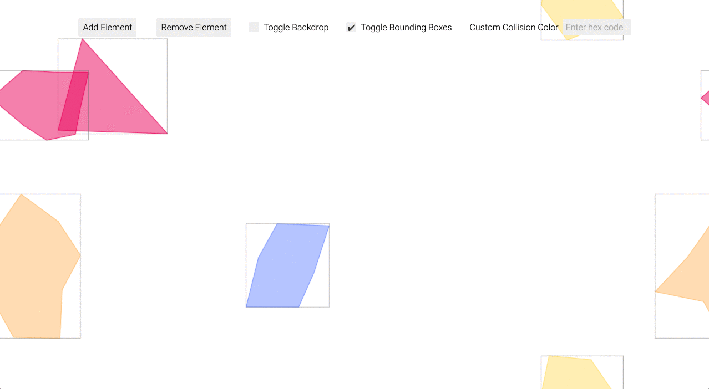

# 2D Collision Detection

This HTML5 Canvas project attempts to achieve a detection system that indicates 2D collision among randomly generated, randomly transforming (simultaneously translating and rotating) polygons.

[View demo](https://yirmiyahu.github.io/2DCollisionDetection).

Don't go crazy with it.
